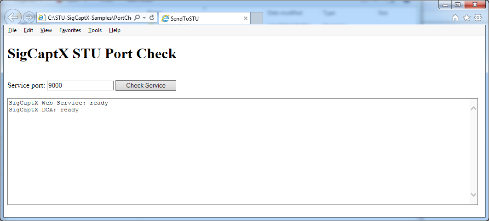
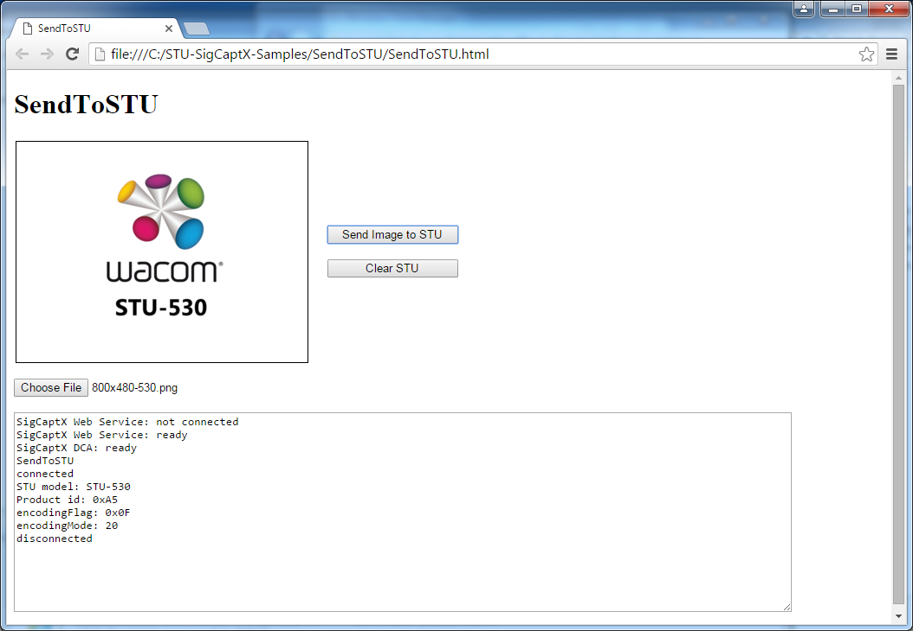
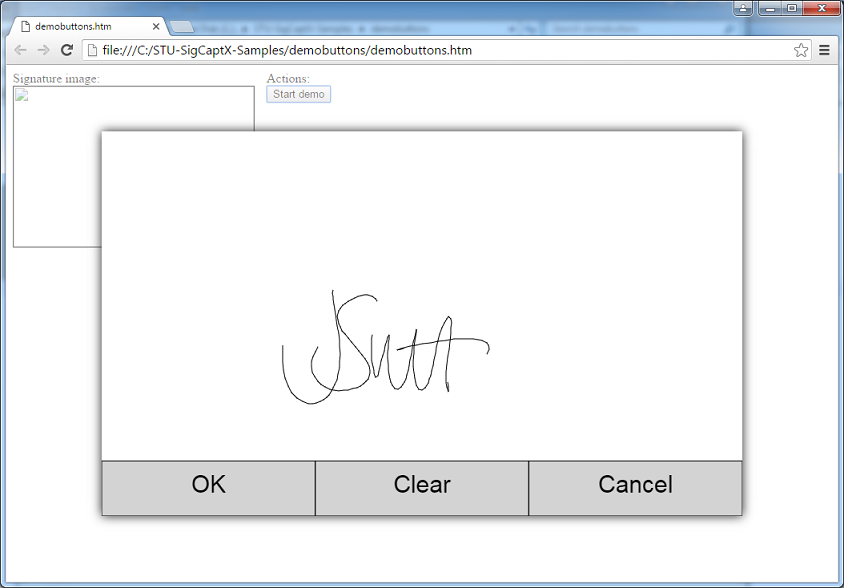

# STU SDK SigCaptX - Getting Started 


## Download the SDK

Download the SDK from https://developer.wacom.com/developer-dashboard

* Login using your Wacom ID
* Select **Downloads for Wacom Device Kit**
* Download **STU SDK for Windows Desktop**
* Accept the End User License Agreement to use the SDK

The downloaded Zip file contains the SDK with documentation.


## SDK license

The SDK is free of charge and does not need a license.

---

## Installation

Run the STU-SigCaptX MSI installer to install the components. The installation includes:

*  Web server
*  JavaScript SDK Framework

### Web Server

The web server consists of four significant parts:

*  Web Service
*  Device Control Application (DCA)
*  Root Certificate
*  Configuration

#### Web Service

wgssSTU_Arbitrator.exe is installed as a Windows service and provides an arbitration service and proxy server.

At startup it reads a configuration value and attaches to the specified localhost port.
By default the service is attached to port 9000.

The web service arbitrates between different instances of the Device Control Application created when each user logs in to Windows. It then provides a proxy server for the application to access the Device Control Application.

#### Device Control Application (DCA)

WgssSTU_DeviceCtl.exe is the DCA application which performs the STU API calls. 
It is installed so that it starts automatically when a user logs in to Windows. 
It makes direct calls to the STU SDK dll: wgssSTU.dll (i.e. the COM interface is not used).

A new instance of the DCA is started when a user logs in to Windows. 
On startup the DCA establishes a connection with the web service using the localhost port. 
Once the connection has been established shared memory is used for all communication between the service and the DCA.


#### Root Certificate

During STU-SigCaptX installation a unique self-signed root certificate is created and installed in the Windows Certificate Store. The certificate is used by the web service to provide a secure WebSocket.
At the end of the installation, the private keys of the certificate authority are deleted so that no one can issue more certificates from that CA. The installed CA is unique and different on each installation and the CA is uninstalled when SigCaptX STU is uninstalled. The certificate issued by the CA is valid only for localhost connections.

The certificate can be viewed in the Windows Certificate Manager as:
	Wacom Localhost STU Certificate Authority


#### Configuration

During installation registry values are created in:
```
[HKEY_LOCAL_MACHINE\SOFTWARE\Wacom\SigCaptXSTU]
```

or for a 32-bit server on 64-bit Windows:
```
[HKEY_LOCAL_MACHINE\SOFTWARE\Wow6432Node\Wacom\SigCaptXSTU]
```

The values are generally reserved for internal use but the following value is used to define the web service start port:
```
Port	REG_DWORD	0x00002328 (9000)
```

If a web service port other than 9000 should be used it can be defined here.

---

## JavaScript SDK Framework


The JavaScript SDK framework is supplied in the files:
* **q.js**  - callback function handling (open-source Q library)
* **wgssStuSdk.js** 	- Wacom STU SDK functions

A web application includes the framework script in the normal way:
``` 
<script src="q.js" charset="UTF-8"></script>
<script src="wgssStuSdk.js" charset="UTF-8"></script>
```

In order to deal with asynchronous procedures, wgssStuSdk.js makes extensive use of the Q library:
 		https://github.com/kriskowal/q

All functions in wgssStuSdk.js return a q promise, described in the reference.

wgssStuSdk.js replicates the API of the Wacom STU SDK. 
STU objects are created in the DCA and control is passed between the application and DCA via the web service using the secure web socket with JSON data handling. 
The same object methods and properties are available through the framework while the data is held in the DCA. 
That is, the framework provides indirect access to the STU SDK.

### API

The SDK framework is accessed through its main class WacomGSS.STU

An application can create objects equivalent to those using the STU SDK directly including:

| WacomGSS.STU |
| ------------ |
| UsbInterface |
| Protocol     |
| Tablet       |
| EncryptionHandler |

Refer to the Wacom STU API for details of the object methods and properties.

---

## SDK Samples

The samples demonstrate the use of Javscript with STU SigCaptX.

Note that the samples use **console.log()** so that their actions can be monitored.
To view the log in the browser press F12 then select 'console'.


### PortCheck

Use the PortCheck.html test page to verify the STU-SigCaptX installation:



The test page uses the default port for the initial connection. 
If a different port number has been configured its value can be set in the input field.

If SigCaptX is operating correctly the following message appears:
*  SigCaptX Web Service: ready
*  SigCaptX DCA: ready

If the service is not running or is not accessible the following message appears:
*  SigCaptX Web Service: not connected

If the service is running but the DCA is unavailable the following message appears:
*  SigCaptX Web Service: ready
*  SigCaptX DCA: not detected


If the web service is not connected check that the service is running and restart the DCA if necessary.

### SendToSTU

Use the test page SendToSTU.html to verify the STU-SigCaptX operation with an STU tablet:



When the page has loaded the script reports the web service connection status.
Choose an image file then click the Send button to send it to the STU display.

The javascript in the test page demonstrates the fundamental approach to using the sdk framework. 
Calls to the STU SDK use q promises to handle return data, for example:

```
      WacomGSS.STU.getUsbDevices()
      .then( function(message) {
        usbDevices = message;
        intf = new WacomGSS.STU.UsbInterface();
        return intf.Constructor();
      })
```

### Signature Capture

The DemoButtons.html sample demonstrates signature capture, reproducing the functionality of the sample in the standard STU SDK:



The sample uses a copy of the Stanford Crypto Library SJCL.JS for encryption related functions. 
The file is not included with the sample code but can be downloaded from the Stanford website. 
If the file sjcl.js is not present DemoButtons will continue to operate but not use STU tablet encryption.

#### Tablet encryption
DemoButtons.html uses the crypto library sjcl.js for encryption functions.

To avoid any issues of non-compliance with licence requirements the library is not included with the samples.
The samples check for the presence of sjcl.js before calling the functions.
To enable encryption download the file sjcl.js from: Stanford Javascript Crypto Library (SJCL)
The homepage provides a direct link to the sjcl.js 'minified version'.

Copy the downloaded file to the DemoButtons folder to enable encryption.

---
