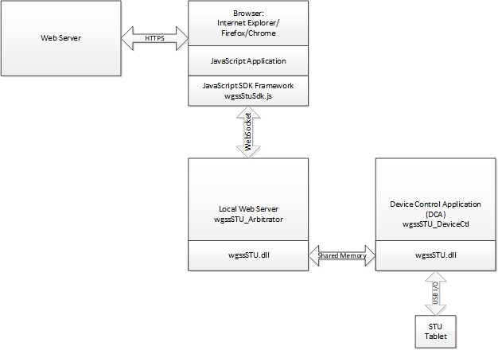

# Wacom Device Kit - STU SDK SigCaptX

## Introduction

Support for ActiveX is no longer available in Internet Explorer and is not generally available in alternative browsers such as Firefox and Chrome.
STU-SigCaptX has been developed to resolve this issue by providing a cross-browser solution.

### ActiveX method summary

The STU SDK is implemented in an ActiveX control wgssSTU.dll and the API can be accessed directly in versions of Internet Explorer which support ActiveX.
Versions of Internet Explorer up to IE10 can be used in this way. 

To view the method schematically:

The general process is as follows:

*  The browser loads an HTML page containing JavaScript application code from the web server.
*  To access the STU tablet, the application calls the STU DLL using ActiveX.
*  The STU DLL performs output including the transfer of images to the STU display.
*  The STU DLL performs input including the transfer of real-time pen data. The application receives pen data by using callback functions. 

### SigCaptX method summary

In a browser with no ActiveX support it is not possible to access the STU DLL directly. 
Instead calls are made indirectly via a local web server which communicates with the separate device control application (DCA). 
A JavaScript SDK framework is provided to replicate the STU SDK API.

To view the solution schematically:

The general process is as follows:

* 	The web browser loads an HTML page containing JavaScript application code from the web server. The application code includes the SDK framework required to access the localhost web server.
* 	The application code calls the STU DLL indirectly by calling a function supplied in the framework. 
* 	The framework returns immediately and queues an application callback function for the result of the call.
* 	The framework passes the call to the web server using a WebSocket connection.
* 	The web server passes the call to the Device Control Application (DCA) where the STU SDK call is made.
* 	On completion the web server starts a queued callback function to return the relevant data.

---

# Additional resources 

## Sample Code
For further samples check Wacom's Developer additional samples, see [https://github.com/Wacom-Developer](https://github.com/Wacom-Developer)

## Documentation
For further details on using the SDK see [Wacom Device Kit - STU SDK](http://will-docs.westeurope.cloudapp.azure.com/stu/) 

The API Reference is available directly in the downloaded SDK.

## Support
If you experience issues with the technology components, please see related [FAQs](http://will-docs.westeurope.cloudapp.azure.com/faqs)

For further support file a ticket in our **Developer Support Portal** described here: [Request Support](http://will-docs.westeurope.cloudapp.azure.com/faqs/docs/q-support/support)

## Developer Community 
Join our developer community:

- [LinkedIn - Wacom for Developers](https://www.linkedin.com/company/wacom-for-developers/)
- [Twitter - Wacom for Developers](https://twitter.com/Wacomdevelopers)

## License 
This sample code is licensed under the [MIT License](https://choosealicense.com/licenses/mit/)

---
